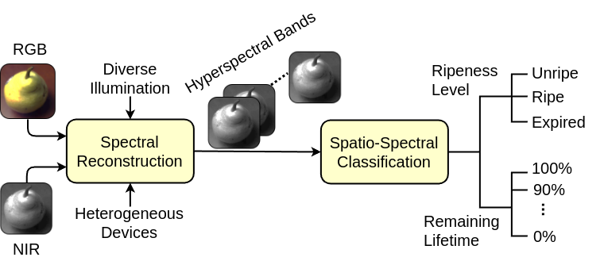

# RipeTrack: Assessing Fruit Ripeness using Smartphones
An overview of RipeTrack is shown in the figure below. Some information regarding the modules in the overview will be discussed below.


## Hyperspectral Reconstruction
The Hyperspectral Reconstruction model is built on PyTorch and is trained to produce hyperspectral cubes when the input to it is an RGB and NIR image.

In order to reproduce our results using our pre-trained models or the models can be trained from scratch.

### Prerequisites
- Python 3.8.10
- PyTorch 1.9.0 (Cuda 11.1)

### Installation
Clone the repository. After Installing the Prerequisites and cloning the repository, the directory tree should look something like this:

```
RipeTrack
│
└── checkpoints			Pretrained models (created)
│
└── dataPreparation		Scripts to prepare the data
│
└── logs			Training and testing logs (created)
│
└── models			Model Architecture Scripts
│
└── visualizationsScripts	Contains scripts to produce various visualizations
│
└── visualizations		Contains output of said scripts (created)
```

Some of the directories are created when the scripts are executed.

### Datasets
Download the datasets from the following links:

- [Pear Bosc](https://drive.google.com/file/d/1ibD8tcYOyy7KDlG6tKgWK8IaWsRhy-Qs/view?usp=drive_link "Pear Bosc (14.3 GB)").
- [Pear Bartlett](https://drive.google.com/file/d/1dwdWF6JUkVClx6ac550kZ5m2UpfBrRC2/view?usp=drive_link "Bartlett (7.3 GB)"), [2](https://drive.google.com/file/d/1lYB3a8Md9Xke-vA44OZ89zk9kyDMJbaC/view?usp=drive_link "(Bartlett 2 (11.9 GB))"), [3](https://drive.google.com/file/d/1ZnPNRkW2EMkiiVjKCbxsjsZ0InTEHKZh/view?usp=drive_link "Bartlett 3 (2.2 GB)").
- [Avocado Organic](https://drive.google.com/file/d/1wel97b1lvpb4eMtouyRnTEfGsXAjMALy/view?usp=drive_link "Avocado Organic (8.2 GB)"), [2](https://drive.google.com/file/d/1fiiiGktBQfR95QwwZWPUI233kq5j0n8V/view?usp=drive_link "Avocado Organic 2 (16.8 GB)").
- [Avocado Hass](https://drive.google.com/file/d/1korY2g7qLBcFfXsP-aXbU1SRFaodoYAB/view?usp=drive_link "Avocado Hass (12.2 GB)").
- [Banana](https://drive.google.com/file/d/1OdPM2rAjJ1nRFwMBVylLpxbL2ytNqqzv/view?usp=drive_link "Banana Ecuador (12.9 GB)"), [2](https://drive.google.com/file/d/1NUNm8_ARbHJK3OeFOJ_jw6WKwlZt3H64/view?usp=drive_link "Guatamala (3.5 GB)").
- [Mango](https://drive.google.com/file/d/12z4iemamsWuhZ188MuHnCF7p9f1Wqy8y/view?usp=drive_link "Mango Ataulfo (8.5 GB)").
- [Nectarine](https://drive.google.com/file/d/1zJyUj2uOe-7VTXbWn4b7Fx8s3ffiSj_1/view?usp=drive_link "Nectarine Chile (8.8 GB)").

The above links contain the whole datasets and might be too large; for just inference (or [Mobile Application](https://github.com/ShahzaibWaseem/RipeTrack-Android "RipeTrack-Android GitHub Page")) you can download the RGB+NIR files using this [link](https://drive.google.com/drive/folders/1oBmib1meInQ5zZzC0itiRDGs5IKJRZPb?usp=drive_link "RGB+NIR Directory (5.4 GB)").

The dataset directories are divided as follows:

```
shelflife
│
└── avocado-hass
│	│
│	└── mobile-reconstructed		Inferred Upsampled Mobile Hypercubes (created)
│	│
│	└── mobile-rgbn				Mobile Image Dataset
│	│
│	└── reconstructed			Inferred Upsampled Hypercubes (created)
│	│
│	└── rgbn				RGB and NIR images
│	│
│	└── rgbnir-sensor			RGB with IR cutoff removed and NIR
│	│
│	└── rgbnir-sensor-reconstructed		Inferred Upsampled Hypercubes for No IR Filter data (created)
│	│
│	└── split				Training, Validation and Testing split
│
│	496_H.mat				Ground truth Hypercubes
│	497_H.mat
│	...
│
└── pear-bartlett
│	│
│	...
```

We captured the images under various illuminations and these are:
- Halogen suffix: `_H`.
- LED suffix: `_L` (warm, neutral and cool color temperatures).
- CFL suffix: `_C`.
- Mixed suffix: `_M` (with the different LED color temperatures).

The starting letters of these are suffixed after the image in `mobile-rgbn`, like _H for Halogen. Lastly, all RGB images are normalized by using [Deep White-Balance Editing](https://github.com/mahmoudnafifi/Deep_White_Balance), in order to represent the RGB image in a common illumination (Daylight; 5500K), these are represented by the suffix `-D`.

Some of the directories (mobile-reconstructed, reconstructed, rgbnir-sensor-reconstructed) are created when the `inference.py` script is run.

`split` directory is created when `RipeTrack/dataPreparation/trainTestDiv.py` script is executed.

### Training
In order to train the spectral upsampling model, you can use the following command:

```console
$ python3 train.py
```

To change any of the parameters like batch sizes, number of epochs, datasets considered, losses considered etc; check `config.py` file.

In order to change the names of datasets considered change `TEST_DATASETS` list variable. By default it is set to `TEST_DATASETS = ["pear-bosc", "pear-bartlett", "avocado-organic", "avocado-hass"]`. Similarly, there is a list for the different loss functions implemented in the code (`losses.py`). In order to change the loss functions used change `lossfunctions_considered` list variable. By default it is set to `lossfunctions_considered = ["MRAE", "SAM", "SID"]`. We've only implemented loss functions for MRAE, SAM and SID; which is what we use in RipeTrack; In order to add your own consider changing the variable and `train.py`. Lastly, the datasets are captured under various illuminations, these can be configured by changing this variable `ILLUMINATIONS`.

If you want to employ Transfer Learning, set `transfer_learning = True` in `config.py`. In order to train on Mobile images, set `use_mobile_dataset = True`. Set `run_pretrained = True` (in `config.py`) if you want to resume training the model (if the script was stopped).

During training, please also check the `dataset.py` for which input set is loaded into the memory.

### Reproduce the results using our pretrained models
To run the inference script, which produces the hypercubes, use the following command:

```console
$ python3 inference.py
```

The same parameters apply here (`config.py`). To use a different model type out the name of it in this variable `checkpoint_filename`, and fix the image sizes if they need fixing. The Pre-trained models can be found here. Place the pre-trained models in `checkpoints/reconstruction/{pre-trained}`.

This script also calculates the errors for the six metrics: MRAE, RMSE, SAM, SID, PSNR, SSIM (`losses.py`). The details are in the manuscript.

In order to produce the Mobile Hypercubes, the command is same as above, set `use_mobile_dataset = True`. The error metrics are not calculated for Mobile dataset, because there are no Ground Truth Hypercubes to compare them to.

**Note**: do not set `use_mobile_dataset = True`, unless you want to perform inference on Mobile Datasets, as otherwise it will select wrong band numbers.

### Extension to other fruits
In order to extend RipeTrack to other fruits, first of all, we need to spicify which datasets we need to include in `TEST DATASETS`. In RipeTrack, we change it to the following list `TEST_DATASETS = ["mango-ataulfo", "banana-ecuador", "banana-guatamala", "nectarine-chile"]`. Moreover, change the variable `transfer_learning = True` (in `config.py`).

## Ripeness & Remaining Life Prediction
In RipeTrack we configure this module to use a `64 × 64 × 68` (`h × w × c`) hypercube as input (This can be configured). This hypercube is received from running the `inference.py` [script](#reproduce-the-results-using-our-pretrained-models) from the reconstruction model on mobile datasets (`use_mobile_dataset` in `config.py`).

The classification model script, which loads the data and runs the classification model, produce both the ripeness prediction and the remaining life estimation. To run the script, use the following command:

```console
$ python3 torch_classifier.py
```

Same Transfer Learning logic applies to this module as well.

## Mobile Application
We created an Android Application for RipeTrack, which can be found [here](https://github.com/ShahzaibWaseem/RipeTrack-Android) on GitHub.